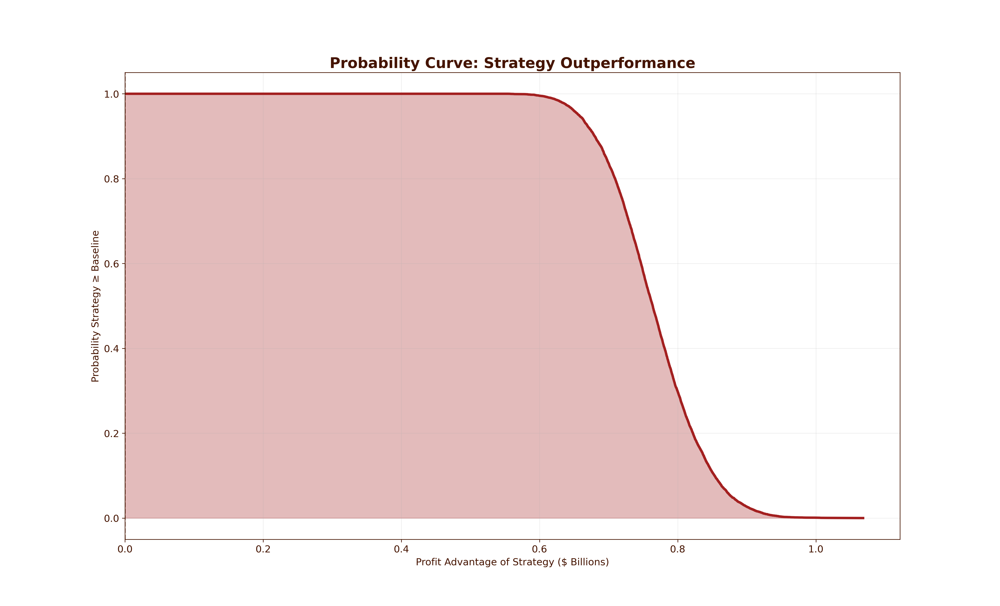
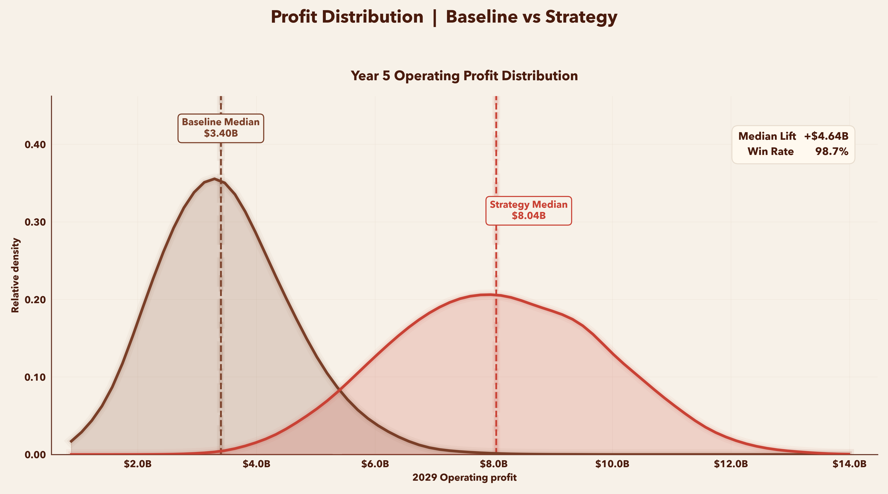
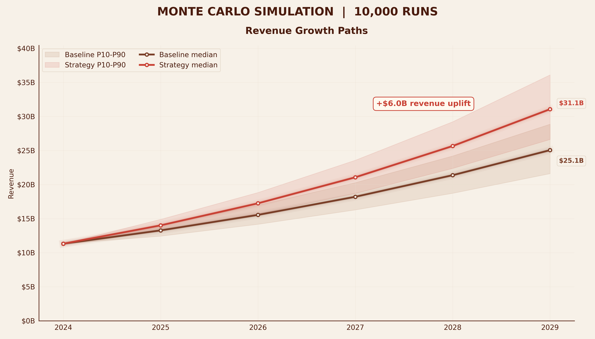
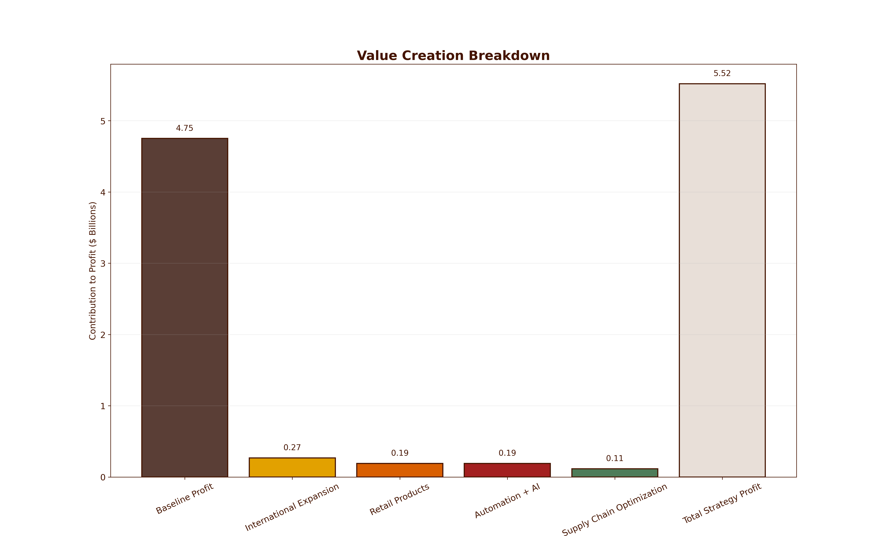

# 🌯 Chipotle Monte Carlo Financial Model  
### Stochastic Financial Forecasting & Strategic Impact Simulation

A high-fidelity Monte Carlo simulation modeling Chipotle’s financial trajectory under strategic business recommendations.  
This project applies stochastic modeling, financial analysis, and data visualization to evaluate long-term growth, profitability, and risk.

---

## 📊 Overview

This model simulates **10,000+ potential financial outcomes** based on variability in:

- Revenue growth rates  
- Operating margins  
- Cost efficiencies  
- Strategic investments  

The goal is to quantify how targeted recommendations — including international expansion, automation, and AI-driven supply chain optimization — impact Chipotle’s future performance.

---

## 🧮 Methodology

We use a **Monte Carlo framework** to introduce randomness into key financial drivers:

### Revenue Growth
- Baseline growth sampled from normal distribution  
- Strategy adds stochastic boosts from:
  - International expansion  
  - Retail channel growth  
  - Venture investments  

### Margin Expansion
- Baseline operating margin with variance  
- Strategy includes efficiency gains from:
  - Automation (Hyphen system)  
  - AI demand forecasting  
  - Supply chain optimization  

### Simulation Scale
- 10,000 simulations  
- 5-year projection horizon  
- Full distribution of outcomes analyzed  

---

## 📈 Key Results

| Metric | Baseline | Strategy |
|------|--------|----------|
| Revenue (Year 5) | ~$28B | ~$31B |
| Profit (Year 5) | ~$4.76B | ~$5.53B |
| Outperformance Probability | — | **~95–100%** |

> The model demonstrates a consistent rightward shift in both revenue and profit distributions, indicating strong expected value creation.

---

## 📊 Visualizations

### 1. Probability Curve — Strategy Outperformance

- Shows probability distribution of profit advantage  
- Area under curve represents likelihood of strategy success  
- Nearly all simulations outperform baseline  

---

### 2. Profit Distribution

- Full distribution of simulated outcomes  
- Strategy shifts mean profit significantly higher  
- Reduced downside risk and increased upside potential  

---

### 3. Revenue Growth Paths

- Median trajectory comparison  
- Strategy accelerates compounding growth  
- Interquartile bands show uncertainty range  

---

### 4. Value Creation Breakdown

- Decomposes profit uplift drivers:
  - International Expansion  
  - Retail Channels  
  - Automation + AI  
  - Supply Chain Optimization  

---

## 🧾 Financial Interpretation

### Profitability
- Margins remain stable to improving (~17% → ~18%)  
- Profit growth driven primarily by revenue expansion  

### Efficiency
- Asset turnover improves through better capital allocation  
- ROIC trends upward with operational optimization  

### Liquidity & Solvency
- Strong free cash flow (~$1.5B+)  
- Low leverage enables reinvestment flexibility  

---

## ⚙️ Tech Stack

- Python  
- NumPy  
- Matplotlib  
- Monte Carlo Simulation  
- Financial Modeling  

---

## 🎯 Why This Matters

This project demonstrates how **quantitative modeling can validate strategic business decisions** by:

- Measuring risk vs reward  
- Simulating real-world uncertainty  
- Translating strategy into financial outcomes  

---

## 🚀 Future Improvements

- Add discount rate → DCF valuation layer  
- Incorporate macroeconomic variables (inflation, rates)  
- Expand to multi-scenario regime modeling  
- Build interactive dashboard (Streamlit)  

---

## 👤 Authors

**Arnav Kanderi**  
Finance • Quantitative Modeling • Software Engineering  

---

## ⭐ Final Takeaway

> This is not just a projection — it’s a probabilistic view of the future.

The model shows that with the right strategic execution, Chipotle can transition from **mature stability → accelerated growth**, with a high probability of sustained outperformance.
